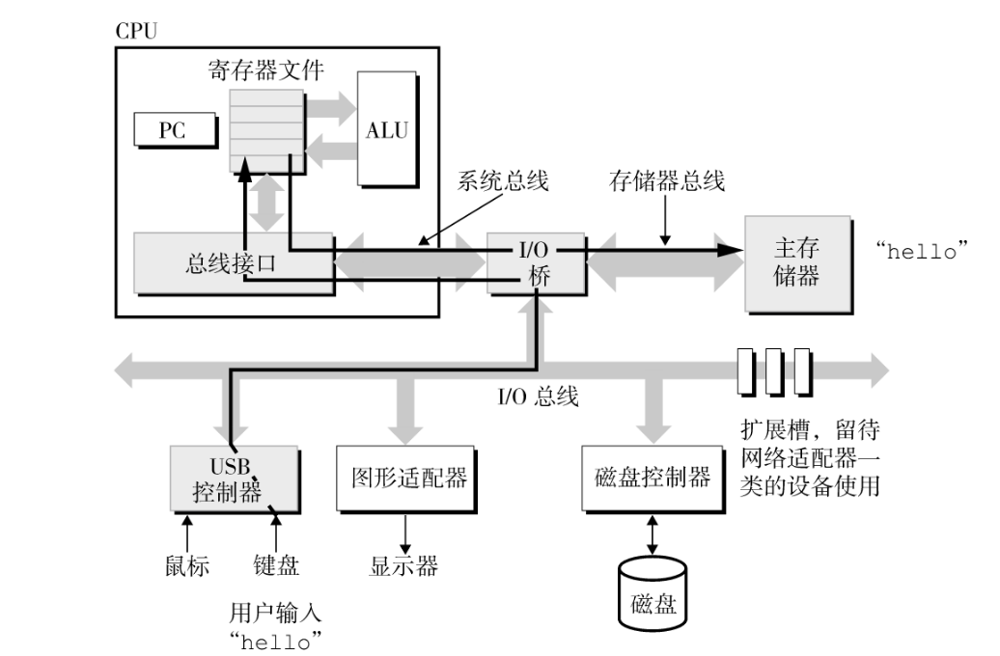
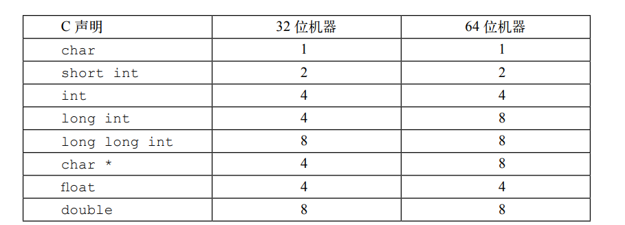
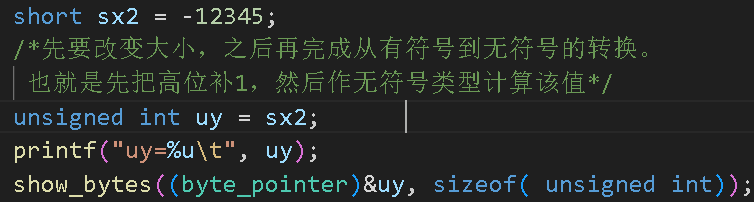
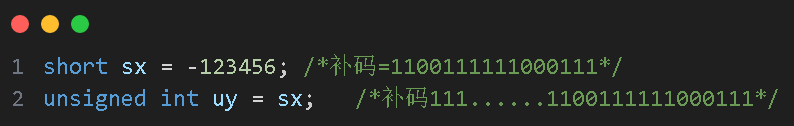
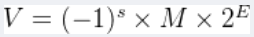
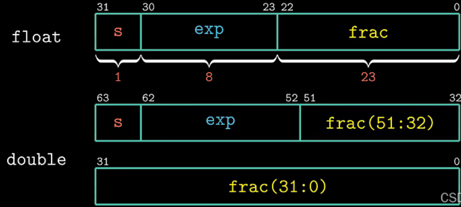
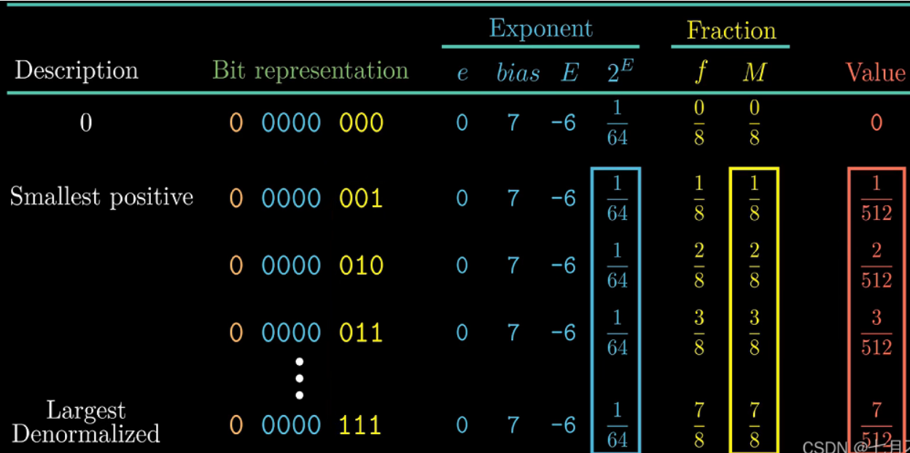
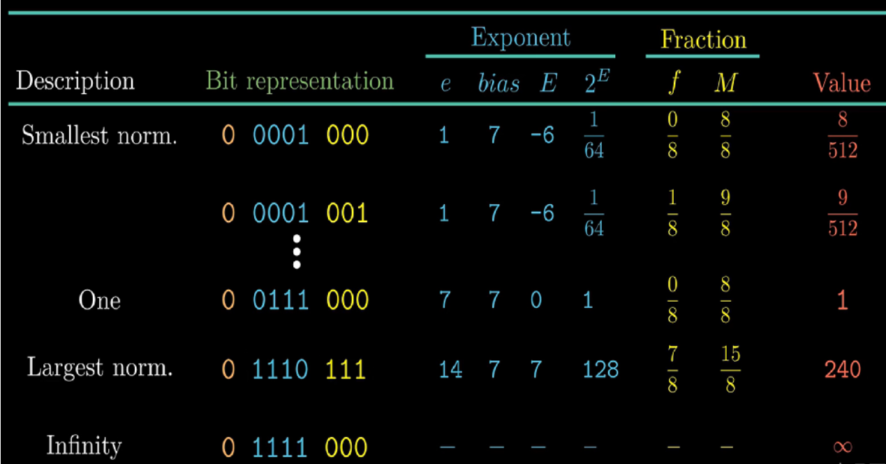

每个I/O设备都通过控制器或适配器与I/O总线相连
如键盘和鼠标通过USB控制器与I/O总线相连
显示器通过图形适配器与I/O总线相连

控制器与适配器区别：
控制器一般内置在I/O设备内，或在主板上的芯片组
适配器则是插在主板卡槽上的的卡



ps:long在64位字长为8

上下文：OS保持跟追踪进程运行时所需的所有状态信息，包括PC、寄存器等内容

当进程的时间片到时就需要进行上下文切换，保存当前进程上文，恢复新的进程的上下文

字长：每台计算机都有一个字长，决定虚拟地址空间的最大大小，实际上就是机器位数，64位机的字长就是64
在存储中，字长表示计算机在同一时间可以处理的二进制数位数

不同的机器类型使用不同的且不兼容的指令和编码方式，二进制代码不兼容

a ^ (a ^ b) = b

a ^ b = (a | b) & (~a | ~b)

右移分为算术右移和逻辑右移，顾名思义，算数右移会保留原符号
且当右移位数超过类型长度时，实际上会取余，例如对int型x, x >> 32实际上没有发生位移

当执行一个运算时，如果是有符号和无符号的运行，C语言会隐式的将有符号的转为无符号的进行运算，假设这两个数都是非负的进行运算
```cpp
    std::cout << (-1 < 0u) << std::endl;//结果为0，-1被看做是2^32
    std::cout << (2147483647 > (int) 2147483648u) << std::endl;//1
    std::cout << (2147483647U > -2147483647-1) << std::endl;//0
    std::cout << (-1 < 0U) << std::endl;//0
```



当无符号和有符号相互转换时，如short转unsigned int，是先改变大小，再转变符号


# 浮点数
从 float 或者 double 转换成int，值将会向零舍入

浮点数表示标准


在这个式子中设计三个变量，s, M以及E
1. 符号 (sign) : s决定这数是负数 (s = 1) 还是正数 (s = 0)
2. 尾数 (ignificand) : M是一个二进制小数
3. 阶码 (exponent): E的作用是对浮点数加权，这个权重是2的E次幂(可能是负数)

根据阶码的不同，浮点数的数值可以分为三类：

1. 规格化的值 (Normalized Values)
2. 非规格化的值 (Denormalized Values)
3. 特殊值 (Special Values) 特殊值 (Special Values)

根据不同类型，按照不同规则进行存储，float，double数值在内存中存储如下


==当阶码域不全为0并且不全为1时，表示该数值为规格化的值==
E是阶码并且可以表示负值，存放在exp字段，但是E在标准中为无符号数，这说明它不能表示负数且可表示的范围为0~255，当E需要是负值时，引入了偏置（bias）的概念
IEEE 754规定，存入内存时E的真实值必须再加上一个中间数，对于8位的E，这个中间数是127；对于11位的E，这个中间数是1023。这里的127和1023就是Bias。也就是说，阶码的值是 E = exp - Bias
例如：2^10的E是10，所以保存成32位浮点数时，必须保存成10+127=137，即10001001。此时内存中的exp中存的是10001001。

考虑到省略小数点前面的1（取数据的时候可以直接在前面添上），可以节省一位的存储空间，能让小数点后的数据多保存一位，提高数据的精度。
例如，M=1.01101，存到 f 中去的数据为01101，==M = 1 + f==

==当阶码域为全0时, 所表示的数是非规格化的值==
当exp为全0时，此时的E = 1- Bias，也就是说1-127（或者1-1023）即为真实值
ps：这里不是-Bias，是为了提供了一种从非规格化值平滑转换到规格化值的方法，补偿非规格化数的位数没有隐含的开头的1
==M = f==


==当阶码域为全1时, 所表示的数是特殊值==
1.  当小数域全为0 时，得到的值表示无穷，当 s = 0 时，是+∞, 或者当 s = 1时，是 -∞
2.  当小数域为非零时, 结果值被称为 “NaN”(Not a Number)。一些运算的结果不能是实数或无穷, 就会返回这样的NaN值

用一个8位浮点数的例子，假定符号位 s 的长度为1，阶码字段的长度为4，小数字段的长度为3：

非规格化：


规格化：


## 舍入标准
偶数舍入，向零舍入，向下舍入，向上舍入
舍入规则：
* 当具体的值大于中间值时，向上舍入
* 当具体的值小于中间值时，向下舍入
* 当具体的值等于中间值时，向偶数舍入
### 中间值
确定保留的有效数字，找到有效数字的最低位的下一位，该位为进制的一半，且之后位都是0，则为中间值
如1.2500，保留小数点后一位，下一位为5，是进制的一半，后面位数都为0，所以1.2500就是中间值
如二进制1.0110，保留小数点后两位，下一位是1，是进制的一半，后面位数都为0，所以1.0110就是中间值

对二进制的偶数舍入，支队形如XX..XXX.YY...100.....才有效，最右边的Y是要被舍入的位置
如：(10.1110)2 舍入值到最近的四分之一的问题（二进制小数点后两位）偶数舍入为(11.00)2