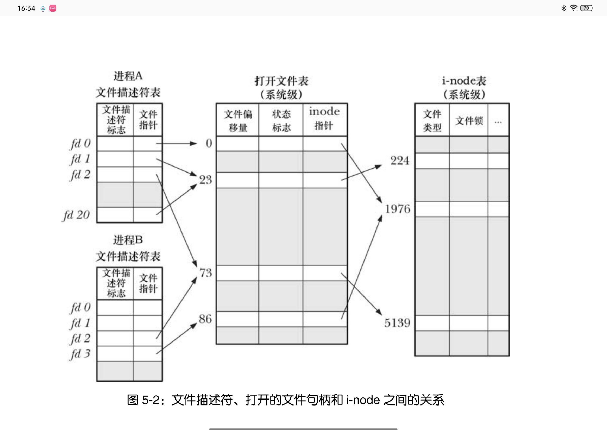
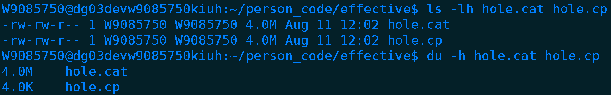

虚拟内存管理机制部分优点：
1. 进程与进程、进程与内核之间彼此隔离，因为一个进程无法读取或修改内核或其他进程的内存内容
2. 只需要加载进程的一部分到内存，可以使RAM加载更改多进程

系统调用都是由唯一的数字来标识的
系统调用不会分配内存缓冲区返回给调用者，而需要掉用户预先分配好缓冲区，将地址传递给系统调用
# 文件

## 文件空洞
EOF（文件结束符）并不是一个字符，而是在读取到文件末尾的时候返回的一个信号值，也就是-1。
当偏移量以跨过文件尾部，执行read()会返回0，而write()会在文件结尾处的任意位置写入数据
文件空洞：从文件结尾后到新写入数据间的这段空间
文件空洞不占用字节，直到在文件空洞写入数据，才会为之分配磁盘块，优势在于稀疏的文件会占用较少的磁盘空间，core dump就是包含文件空洞的例子

如通过ls命令查看一个空洞文件和通过du查看有所差异，因为ls查看的是逻辑大小，而du查看的是实际占用物理块的大小
通过cat重定向和cp复制一个空洞文件也有所差异
cat会将空洞部分用0填充，而cp会模拟源文件调用lseek

## 原子关系
具体谁是文件创建者，open时增加O_EXCL标记
防止直接在文件结尾写数据被覆盖（通过lseek跳到文件末尾），可以直接open时增加O_APPEND标记跳到文件末尾

多线程下，使用pread或pwrite代替lseek和read或write